# Introduction
In this assignment I will demo “pickling” and “error handling in python.
Pickling
First, let me define pickling based on research I have done on the internet.

#	Pickling
Pickling is also known as marshalling or serialization.  
The serialization process is a way to convert a data structure into a linear form that can be stored or transmitted over a network. In Python, serialization allows you to take a complex object structure and transform it into a stream of bytes that can be saved to a disk or sent over a network. 
The reverse process, which takes a stream of bytes and converts it back into a data structure, is called deserialization or unmarshalling.
##	Demo
For my demo, I will create a dictionary object, serialize the data and load it in a file. Then I will do the reverse process deserialize the data back to original object. I will show the data and content of the file at every step to explain what is pickling.

### 1) I created a dictionary object with 3 key/value pair:
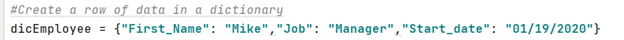

### 2) I show the content as a string with print function.
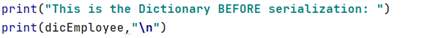

At that stage, the dictionary output from sprint looks like this in ASCII format:
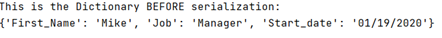
 
### 3) Next I started the serialization.
First, I created 2 variables as file object (pickle_fileA and pickle_fileB) and open one file per variable: Pickle_DumpP5.txt and Pickle_DumpP2.txt using open function. Also, I used “wb” as parameter, meaning write to a binary file. If the file exists, its content is overwritten. If the file does not exist, it is created. 
I opened 2 files as I wanted to test 2 different serialization protocol. 
Then I use the pickle.dump() function to serialize the dictionary (dicEmployee). The function requires 2 mandatory arguments: the data to pickle : dicEmployee (the dictionary) and pickle_file (the destination file). I also added a third optional parameters to test different serialization protocol (5 and 2) as mentioned previously. Once the serialization function is done, I closed both files:

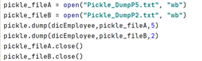
 

### 4) Now, will look at the result of the serialization in the 2 files:
I opened the 2 files with open function in read mode (“r” argument) and then display the output in a string with print function.
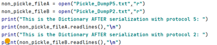
  

The output is not human readable as this is binary conversion to string format however, I can visually see the impact of using 2 different protocol looking at the length of the 2 output.
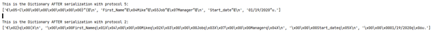
  

### 5) Finally, I deserialize both files to verify that the dictionary remain the same as before serialization.
For this step, I first opened both files using open function and “rb” argument meaning: read binary.
Then, I used the pickle.load() function. The only mandatory argument is the file to read (eg. pickle_fileA) 
I stored the content of pickle.load output into 2 variables: pickle_contentA and pickle_contentB
Eventually I print the output of both variable in string format using print function.
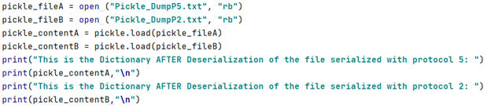

The result of deserialization returns exactly the original dictionary (dicEmployee) content in both cases.
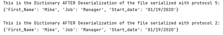

# Error Handling

##	Definition
Error handling refers to the anticipation, detection, and resolution of programming, application, and communications errors.
In Python, exceptions can be handled using a try statement. The critical operation which can raise an exception is placed inside the try clause. The code that handles the exceptions is written in the except clause.

##	Demo
For the demo I will extend the previous pickling demo by trying to deserialize a file which does not exist with load function.
As mentioned above, I start with a try statement and created a variable as file object (pickle_file). Using open function, I specified first the file to be opened and Pickle_DumpS.txt (this file does not exist and will generate the exception). Also, I used “rb” as parameter, meaning: read binary
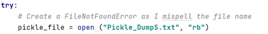
 

The next part is to customize the error message. 
I knew that the exception class was FileNotFoundError after I tried my script in pycharm. All I had to do is to start an except clause and receive the exception’s argument in variable e.
I specified the customized message using the print function. Also I added additional details like the default message and documentation.
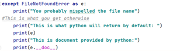 
 
Screenshot in OS
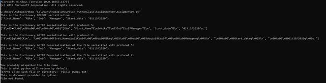
 
Screenshot in PyCharm
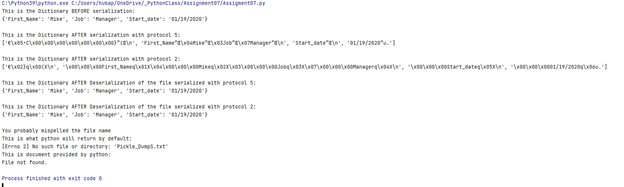 

# Summary

Using the textbook, the Module 07 documentation, and websites I found doing research, I was able to successfully demo pickling and error handling in python.
